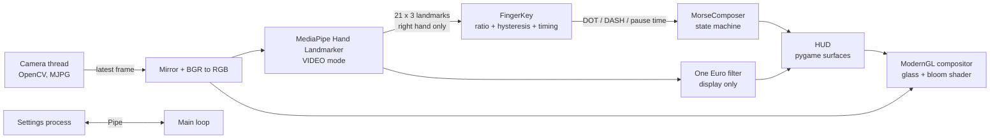

# Morse Hand

Type Morse code in the air with your right hand. A webcam watches your index and middle fingers: touching their tips together works like a telegraph key. A short touch is a dot, a long touch is a dash, and the pauses between touches end letters and words, so the decoded text appears on screen as you go.


<sub>Interface preview, rendered with a placeholder camera image.</sub>

---

## Quick start

### 1. Requirements

| | |
|---|---|
| Python | 3.10, 3.11 or 3.12 (MediaPipe does not always support the newest Python right away) |
| Webcam | Any USB or built-in camera. 30 FPS or more is recommended |
| GPU | Anything that supports OpenGL 3.3 (every integrated GPU from the last ten years) |
| OS | Windows 10/11 (main target), macOS and Linux also work |

### 2. Install

**Windows (PowerShell)**

```powershell
cd AI_computer_vision_morse_coding
python -m venv .venv
.venv\Scripts\Activate.ps1
python -m pip install --upgrade pip
pip install -r requirements.txt
```

**macOS / Linux**

```bash
cd AI_computer_vision_morse_coding
python3 -m venv .venv
source .venv/bin/activate
python -m pip install --upgrade pip
pip install -r requirements.txt
```

> The project uses **pygame-ce**, a maintained fork of pygame. If the classic `pygame` package is already installed in the same environment, remove it first with `pip uninstall pygame`, because both packages provide the `pygame` module.

### 3. Run

```bash
python main.py
```

On the first launch the hand tracking model (`hand_landmarker.task`, about 7.5 MB) is downloaded into `models/`. Later launches work offline.

### 4. Run the tests (optional)

```bash
python -m unittest discover -s tests -v
```

The tests cover the Morse logic and the gesture detector and do not need a camera.

---

## How to use it

Hold your **right hand** up to the camera, palm facing the screen. The left hand is ignored on purpose, so it can rest or hold a coffee.

Keep the index and middle fingers slightly apart (a small V) while resting. A line is drawn between the two fingertips so you can see the gap.

Everything is timed in one unit **t** (0.20 s by default, adjustable in the settings window):

| Gesture | Action |
|---|---|
| Index and middle tips touch for **less than 1.5 t** | Add a dot `·` (typed when the fingers separate) |
| Index and middle tips touch for **1.5 t or longer** | Add a dash `–` (typed as soon as 1.5 t is reached) |
| Fingers apart for **3 t** | End the letter and show it |
| Fingers apart for **7 t** | Add a space |

While the fingers touch, a ring around the contact point fills up towards a dash, and the line turns from the dot colour to the dash colour. While they are apart, a small bar under the code counts down to "end letter" and then to "space".

**Example: typing "HI"** (t = 0.20 s)

1. Four short touches (`····`), then keep the fingers apart for 0.6 s. **H** pops up.
2. Two short touches (`··`), then keep them apart for 0.6 s. **I** pops up.
3. Keep them apart until 1.4 s in total to add a space before the next word.

### Screen layout

The window is a 480 × 800 portrait (3:5):

| Area | What it shows |
|---|---|
| Top black strip | The Morse chart. While a letter is in progress it dims every character you can no longer reach and highlights the exact match, so you never need to memorise the whole alphabet. |
| Middle | The camera with its original colours, kept at its own aspect ratio so the image is never stretched. The dots and dashes of the letter you are typing appear in the centre, with no box around them, until the letter ends and pops up as a Latin letter. |
| Bottom black strip | The message box at the very bottom, and above it the messages you have already sent, shown as chat bubbles with the time. |

**Sending a message.** Press `Enter` to send what is in the message box. It moves up into the chat as a bubble (newest at the bottom, older ones pushed up) and the box is emptied for the next message. The chat history lasts until the app is closed.

### Keyboard shortcuts

| Key | Action |
|---|---|
| `Enter` | Send the message to the chat above the message box |
| `X` | Open or close the camera settings window |
| `H` | Show or hide the Morse chart |
| `M` | Mute or unmute sounds |
| `Backspace` | Delete the last symbol, or the last letter if no symbol is pending |
| `Delete` | Clear everything |
| `Esc` / `Q` | Quit |

### Camera settings window


Press `X` to open it. Changes apply instantly and are saved to `settings.json` when the app closes.

- **Live stats**: the real capture resolution, camera FPS and app FPS. Green is 30 FPS or more, amber is 15 to 30, red is below 15. FPS is shown only here, not on the main screen.
- **Camera**: device number, resolution, target FPS (30 or 60), mirror view, auto exposure, and manual exposure, brightness, contrast and gain.
- **Gestures**: how close the index and middle fingertips must be to count as a touch, the time unit t, and a switch for cameras that report left and right the wrong way round.
- **Driver settings** (Windows): opens the camera maker's own settings dialog for anything not listed here.

### Troubleshooting

| Problem | Fix |
|---|---|
| "Camera unavailable" | Close other apps using the camera (Teams, Zoom, OBS), or pick another device number in the settings window. |
| FPS below 15 | Choose 640×480 and 60 FPS in settings, turn off auto exposure in a dark room (long exposure halves the frame rate), and plug the laptop in. |
| Touches trigger too easily or not at all | Lower or raise **Touch distance** in the settings window. |
| Right hand is ignored | Turn on **Swap left / right** in the settings window. |
| Model download fails | Download the file from the URL in `morse_hand/config.py` and save it as `models/hand_landmarker.task`. |

---

## Tech stack

| Part | Library | Why |
|---|---|---|
| Hand tracking | [MediaPipe Hand Landmarker](https://ai.google.dev/edge/mediapipe/solutions/vision/hand_landmarker) | Finds 21 points on each hand in real time on a normal CPU |
| Camera | [OpenCV](https://opencv.org/) | Reads the webcam and controls exposure, brightness and so on |
| Window and input | [pygame-ce](https://pyga.me/) | Window, keyboard, text rendering and sound playback |
| Rendering | [ModernGL](https://github.com/moderngl/moderngl) (OpenGL 3.3) | Draws the blurred glass panels and the glow on the graphics card |
| Maths | [NumPy](https://numpy.org/) | Landmark maths, smoothing filter and sound synthesis |
| Fonts | Inter and JetBrains Mono | Bundled in `assets/fonts` under the SIL Open Font License |

No sound files and no image assets are shipped: every sound is synthesised at start-up and every shape is drawn in code.

---

## How it works (non-technical overview)

Think of the app as a small assembly line with five stations.

1. **The camera takes pictures.** About 30 to 60 times a second, the webcam sends a new picture of you.

2. **The hand finder draws a skeleton.** A pre-trained model from Google looks at each picture and places 21 dots on your hand: the wrist, every knuckle and every fingertip. It also says which hand is the left one and which is the right one. The app only listens to the right hand.

3. **The touch detector watches two fingertips.** The app measures the gap between the tip of the index finger and the tip of the middle finger. When the gap becomes very small, it counts as a touch. The gap is compared with the size of your palm, so it works the same whether your hand is close to the camera or far from it. To avoid mistakes from a shaky picture, a touch must be seen in two pictures in a row before it counts, and the fingers have to open clearly before it ends.

4. **The Morse translator builds letters.** Like a telegraph key, the length of each touch decides the symbol: short is a dot, long is a dash. The length of the gap after it decides the rest: a short gap ends the letter, a long gap adds a space. The dots and dashes of a letter are looked up in the international Morse table, exactly like a telegraph operator would do with a code book. If the code does not exist, the app shows a red question mark instead of guessing.

5. **The screen shows the result.** The camera picture keeps its normal colours. The dots and dashes you type glow in the middle of the picture, each finger has its own colour, and a short sound confirms every action. The finished letter pops up in the middle and is added to the message at the bottom. Press Enter and the message moves up into a chat history, like a messaging app.

The app never records or uploads anything. Every picture is processed in memory and thrown away straight after.

---

## How it works (technical deep dive)

### Pipeline



### Threads and processes

- **Camera thread** (`camera.py`) blocks on `VideoCapture.read()` and publishes only the newest frame through a `threading.Condition`. The main loop waits on the condition, so it wakes up as soon as a frame arrives and never processes the same frame twice. `CAP_PROP_BUFFERSIZE = 1` and MJPG are requested so frames are fresh and 720p can still reach 30 to 60 FPS. On Windows the backends are tried in the order DirectShow, Media Foundation, default.
- **Main thread** runs detection, gestures, HUD drawing and the OpenGL composition.
- **Settings process** (`settings_window.py`). The main window owns an OpenGL context, and a second SDL window in the same process can steal or invalidate it. Running the settings UI in a `spawn` child process avoids that and keeps slider dragging from stalling the render loop. Messages are small tuples over a `multiprocessing.Pipe`: `("set", section, key, value)`, `("action", name)`, `("stats", {...})`, `("props", {...})`.

### Hand tracking and handedness

MediaPipe's Tasks API runs in `VIDEO` mode, which reuses the previous frame's hand position instead of running the palm detector every time. That is cheaper and steadier than `IMAGE` mode. Timestamps are forced to be strictly increasing because `detect_for_video` rejects duplicates.

MediaPipe labels handedness as if the image were a mirrored selfie. The frame is mirrored before detection when **Mirror view** is on, so the label is used as is. With mirroring off the label is flipped, and the **Swap left / right** option covers cameras whose driver already mirrors the image.

### Touch detection (`gestures.py`)

```
ratio = |index_tip - middle_tip| / |wrist - middle_mcp|
```

- Distance uses x and y in pixels plus half-weighted depth `z`. Monocular depth is noisy, but a small weight still helps when the fingers overlap in 2D.
- Normalising by palm length makes the threshold independent of distance to the camera. A unit test checks that a half-size hand gives the same result.
- **Hysteresis**: a touch starts below `touch_ratio` (0.25) and ends above `touch_ratio + release_gap` (0.35).
- **Debounce**: `CONFIRM_FRAMES = 2` and `RELEASE_FRAMES = 2`.
- **Timing** (`FingerKey`): `DASH` fires the moment a touch reaches 1.5 t, while the fingers are still together, so it lands without waiting. `DOT` can only be known when the fingers separate before 1.5 t. `pause_time()` is the time since the fingers separated.
- If the hand leaves the frame during a touch, the touch ends without typing a dot and the pause starts counting.
- `closeness` (0 to 1) is exported for the visuals: the line between the two fingertips gets brighter as they get closer.

### Morse state machine (`morse.py`)

`MorseComposer` knows nothing about cameras, so it can be tested with plain function calls.

| State | Input | Result |
|---|---|---|
| any | dot / dash | append to `code` |
| `code` not empty | fingers apart for 3 t | decode, `LETTER` or `INVALID` |
| a letter typed since the last space | fingers apart for 7 t | `SPACE` (never leading, never doubled) |
| `code` longer than 6 | dot / dash | `INVALID` right away, since no code is that long |
| any | `Backspace` | delete last symbol, otherwise last character |

`update_pause(pause, letter_gap, word_gap)` is called every frame with the time since the fingers separated; each step fires once per pause. `pause_state()` tells the HUD what the pause is counting towards.

The table follows ITU-R M.1677-1 for A to Z, 0 to 9 and common punctuation. `candidates(prefix)` powers the live chart and the prediction preview.

### Smoothing

Drawing uses a vectorised **One Euro filter** (Casiez et al., 2012) on all 63 landmark values: heavy smoothing when the hand is still, almost none when it moves fast. Gesture detection deliberately uses the raw landmarks so a quick tap is never delayed by the filter.

### Rendering (`compositor.py` and `hud.py`)

Each frame uploads three textures and draws one full-screen triangle strip with a single fragment shader:

1. **Camera texture**. The camera is drawn only inside `CAMERA_RECT` (480 × 360, vertically centred in the 480 × 800 window) with its original colours, no filter. A cover crop (like CSS `object-fit: cover`) keeps any camera aspect ratio undistorted inside that rectangle. Everything outside it is black. Hand landmarks are mapped into the same rectangle, so the skeleton lines up with the hand.
2. **Panels**. The HUD sends the chart and message box as rectangles in uniforms. For each pixel the shader computes a rounded-rectangle signed distance field, giving anti-aliased edges, a dark tint, a hairline border that is brighter at the top, and an optional accent colour used for flashes on commit, error or send.
3. **Glow layer**. An opaque black pygame surface where bright shapes are added with `BLEND_RGB_ADD`. The shader adds three mip levels (1.0, 2.6, 4.2) of it, which gives a bloom effect without extra framebuffers or blur passes.
4. **UI layer**. A transparent pygame surface with text, the hand skeleton, the Morse code in progress and the chat bubbles, blended last. It is cleared to a near-white colour with zero alpha so that anti-aliased edges of light text do not get dark fringes.

Chat bubbles are word-wrapped to 330 px, cached per message, and drawn inside a clip rectangle between the camera and the message box, so older messages simply scroll out of view at the top.

Text surfaces and the Morse chart (keyed by the current prefix) are cached, so a typical frame only renders the message line and a few animated shapes.

### Audio (`audio.py`)

Tones are built with NumPy: a sine wave plus a soft second harmonic and a short linear attack and release to prevent clicks. The dash lasts three times as long as the dot, like real Morse timing. If no audio device is found the app simply stays silent.

### Performance budget

Measured on the CPU side (camera texture upload, HUD drawing, layer upload): about 10 ms per frame. MediaPipe adds roughly 8 to 20 ms depending on the CPU. That leaves the app comfortably between 30 and 60 FPS on a typical laptop. VSync is switched off so the camera, not the monitor, sets the pace and no extra frame of latency is added between a touch and its feedback.

---

## Project structure

```
AI_computer_vision_morse_coding/
├── main.py                  entry point
├── requirements.txt
├── morse_hand/
│   ├── app.py               main loop, wires everything together
│   ├── config.py            constants, colours, saved settings
│   ├── camera.py            threaded webcam reader
│   ├── hand_tracker.py      MediaPipe wrapper, model download, handedness
│   ├── gestures.py          index-to-middle finger key with timing
│   ├── morse.py             Morse table and composer state machine
│   ├── filters.py           One Euro smoothing filter
│   ├── hud.py               everything drawn on top of the camera
│   ├── draw.py              anti-aliased shapes, glow sprites, easing
│   ├── compositor.py        ModernGL shader: camera area, panels and bloom
│   ├── audio.py             synthesised feedback sounds
│   └── settings_window.py   camera settings window (separate process)
├── assets/fonts/            Inter and JetBrains Mono (OFL)
├── models/                  hand model, downloaded on first run
├── docs/                    screenshots for this README
└── tests/                   unit tests for Morse logic and gestures
```

## Credits

- Hand tracking model: Google MediaPipe, Apache License 2.0.
- Fonts: Inter by Rasmus Andersson and JetBrains Mono by JetBrains, both under the SIL Open Font License 1.1 (licence files in `assets/fonts`).
