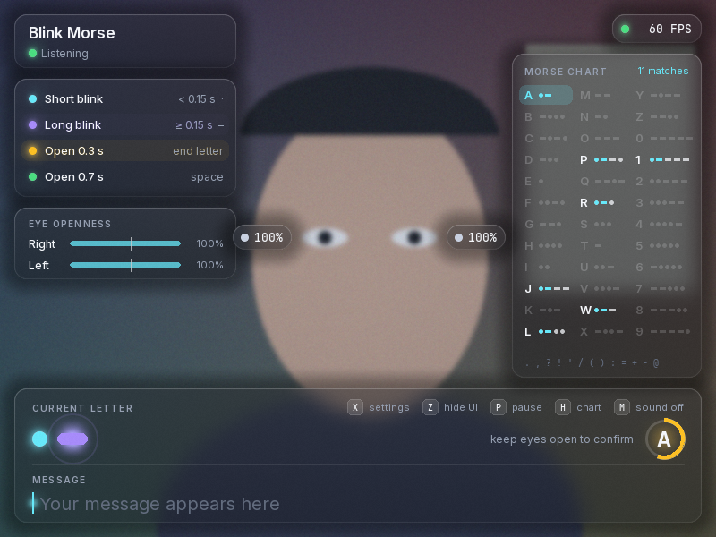
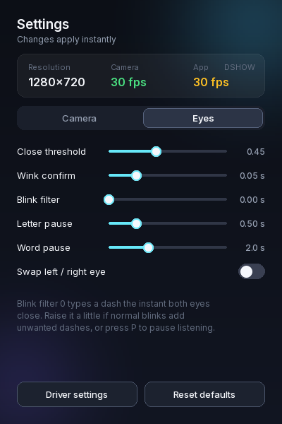
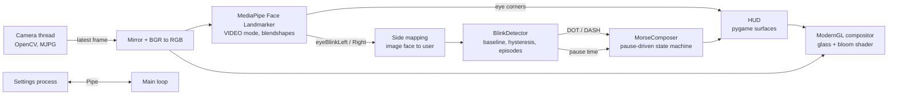

# Squat Morse

Type Morse code by doing squats: going down briefly is a dot, holding the squat is a dash, and standing up marks the end of a letter or a word. Typing is only on while your **two hands touch each other**, for example clasped in front of your chest. The app measures the knee angle with MediaPipe Pose and draws a thin, small skeleton of the whole body on the camera image.


<sub>Interface preview, rendered with a placeholder camera image.</sub>

---

## Quick start

### 1. Requirements

| | |
|---|---|
| Python | 3.10, 3.11 or 3.12 (MediaPipe does not always support the newest Python right away) |
| Webcam | Any USB, built-in or phone camera. 30 FPS or more is recommended |
| GPU | Anything that supports OpenGL 3.3 (every integrated GPU from the last ten years) |
| OS | Windows 10/11 (main target), macOS and Linux also work |

### 2. Install

**Windows (PowerShell)**

```powershell
cd AI_computer_vision_morse_coding
python -m venv .venv
.venv\Scripts\Activate.ps1
python -m pip install --upgrade pip
pip install -r requirements.txt
```

**macOS / Linux**

```bash
cd AI_computer_vision_morse_coding
python3 -m venv .venv
source .venv/bin/activate
python -m pip install --upgrade pip
pip install -r requirements.txt
```

> The project uses **pygame-ce**, a maintained fork of pygame. If the classic `pygame` package is already installed in the same environment, remove it first with `pip uninstall pygame`, because both packages provide the `pygame` module.

### 3. Run

```bash
python main.py
```

On the first launch the pose model (`pose_landmarker_lite.task`, about 5.5 MB) is downloaded into `models/`. Later launches work offline.

### 4. Run the tests (optional)

```bash
python -m unittest discover -s tests -v
```

The tests cover the Morse logic, the blink detector and the left/right eye mapping. They do not need a camera.

---

## How to use it

Stand so that your whole body is in view (front or side both work). Squats are read from the knee angle (hip, knee, ankle), averaged over the legs the camera can see: about 165° or more = **standing**, about 95° = **deep squat**. The body counts as down once the depth passes the **down threshold** (50 % ≈ 130°), and as standing again once it rises 10 % above it.

**Switch: touch your hands together.** Input is on only while the two hands touch, so you can clasp them in front of your chest and squat. Pull them apart and typing stops at once; a squat in progress is dropped without typing anything. The hands count as touching when the distance between their centres is under 0.30 of your torso length (adjustable, *Hands touch distance* in the settings), so it works at any distance from the camera. When you touch your hands while already squatting, stand up once before the first squat counts.

All timings come from one time unit **t** (0.6 s by default, adjustable in the settings window):

| Squat | Result | With t = 0.6 s |
|---|---|---|
| **Down**, shorter than 1.5 t | Dot `·` | under 0.9 s |
| **Down**, 1.5 t or longer | Dash `–` | 0.9 s or more |
| **Standing for 5 t** | End of letter, the Latin letter pops up | 3.0 s |
| **Standing for 10 t** | End of word, a space is added | 6.0 s |

A dash is typed the moment you have been down for 1.5 t, while you are still down. A dot is typed when you stand back up. Letters and spaces end by time alone, so they also complete if you let go of your hands.

**Skeleton.** The whole body is drawn with thin lines and small joints, with a ring on each hand and a line between them. The line is green while the hands touch and faint white while they are apart. The skeleton is grey while input is off, green once the hands touch, cyan while you are down (a dot so far) and violet once it has become a dash. The Squat depth panel shows the depth bar (white tick = threshold), the hands status and the knee angle.

Press **P** to pause listening while you rest, or **Z** to hide the interface and stop input completely. Deleting is done on the keyboard.

### Keyboard shortcuts

| Key | Action |
|---|---|
| `X` | Open or close the settings window |
| `Z` | Hide or show the interface. Hidden = normal camera colours and no typing |
| `P` | Pause or resume listening |
| `H` | Show or hide the Morse chart |
| `M` | Mute or unmute sounds |
| `Backspace` | Delete the last symbol, or the last letter if no symbol is pending |
| `Delete` | Clear everything |
| `Esc` / `Q` | Quit |

### Settings window



Press `X` to open it. It has two tabs. Changes apply instantly and are saved to `settings.json` when the app closes.

**Camera tab**
- Live stats: the real capture resolution, camera FPS and app FPS. Green is 30 FPS or more, amber is 15 to 30, red is below 15.
- Device number, with the device name underneath on Windows (for example "Integrated Webcam" or "Camo"), resolution, target FPS (30 or 60), mirror view, auto exposure, and manual exposure, brightness, contrast and gain.
- **Driver settings** (Windows) opens the camera maker's own settings dialog.

**Squat tab**
- **Down threshold**: how deep you must squat to count as down (5 % to 95 %, default 50 %).
- **Time unit t**: the base timing, from 0.1 to 1.5 s. A card below the sliders spells out the dot, dash, letter and space timings for the current value.
- **Hands touch distance**: how close the hands must be to count as touching, as a fraction of your torso length (0.10 to 0.80, default 0.30).

### Using an iPhone or Android phone as the camera

A phone camera is usually much sharper than a laptop webcam, and sharper eyes make blinks easier to read. Install a "phone as webcam" app such as Camo, iVCam or EpocCam on both the phone and the PC, connect the phone by USB, and the phone shows up as an extra camera. In the settings window, step **Device** to the new camera (its name is shown on Windows). Put the phone at eye level and light your face from the front.

### Troubleshooting

| Problem | Fix |
|---|---|
| "Camera unavailable" | Close other apps using the camera (Teams, Zoom, OBS), or pick another device in the settings window. |
| FPS below 15 | Choose 640×480 in settings, turn off auto exposure in a dark room (long exposure halves the frame rate), and plug the laptop in. |
| Blinks are missed | Lower **Close threshold** a little. Good, even lighting on the face helps most. |
| Quick blinks come out as dashes | Raise **Time unit t**. |
| Letters or words end before you are done | Raise **Time unit t**. |
| Typing feels slow | Lower **Time unit t**. |
| Normal blinks add symbols | Press **P** while resting, or **Z** to switch input off. |
| Input feels slow | Choose 60 FPS in settings. At 30 FPS each frame is 33 ms apart, at 60 FPS only 17 ms. |
| Left and right are swapped | Turn on **Swap left / right eye**. |
| Glasses | Usually fine. Strong reflections on the lenses can hide the eyelids, so tilt the screen or the light slightly. |
| Model download fails | Download the file from the URL in `blink_morse/config.py` and save it as `models/face_landmarker.task`. |

---

## Tech stack

| Part | Library | Why |
|---|---|---|
| Face tracking | [MediaPipe Face Landmarker](https://ai.google.dev/edge/mediapipe/solutions/vision/face_landmarker) | 478 face points plus 52 expression scores, including one blink score per eye, in real time on a normal CPU |
| Camera | [OpenCV](https://opencv.org/) | Reads the webcam and controls exposure, brightness and so on |
| Window and input | [pygame-ce](https://pyga.me/) | Window, keyboard, text rendering and sound playback |
| Rendering | [ModernGL](https://github.com/moderngl/moderngl) (OpenGL 3.3) | Draws the frosted glass panels and the neon glow on the graphics card |
| Maths | [NumPy](https://numpy.org/) | Signal maths and sound synthesis |
| Camera names | [pygrabber](https://github.com/andreaschiavinato/python_grabber) (Windows, optional) | Lists DirectShow device names for the settings window |
| Fonts | Inter and JetBrains Mono | Bundled in `assets/fonts` under the SIL Open Font License |

No sound files and no image assets are shipped: every sound is synthesised at start-up and every shape is drawn in code.

---

## How it works (non-technical overview)

Think of the app as a small assembly line with five stations.

1. **The camera takes pictures.** About 30 to 60 times a second, the webcam sends a new picture of you.

2. **The face reader measures your eyes.** A pre-trained model from Google finds your face and gives each eye a score from 0 (wide open) to 1 (fully shut). Everybody's eyes rest at a slightly different level, so the app first learns what "open" looks like for you, and measures closing from there.

3. **The blink reader times each blink.** It works like a telegraph key, where the length of each press matters. A short blink is a dot; as soon as a blink lasts longer than one and a half time units, it becomes a dash, without waiting for the eyes to open.

4. **The Morse translator listens to the silence.** Like a radio operator, it treats a short silence as the end of a letter and a longer one as the end of a word. After three time units with your eyes open, the dots and dashes collected so far are looked up in the international Morse table. After seven, a space is added. If a code does not exist, the app shows a red question mark instead of guessing.

5. **The screen shows the result.** The camera picture is dimmed and information panels that look like frosted glass float around it. A small label next to each eye shows how open it is, the newest symbol ripples when it lands, and the finished letter pops up and is added to the message at the bottom. A short sound confirms every symbol, so you can type without looking.

The app never records or uploads anything. Every picture is processed in memory and thrown away straight after.

## How it works (technical deep dive)

### Pipeline



### Threads and processes

- **Camera thread** (`camera.py`) blocks on `VideoCapture.read()` and publishes only the newest frame through a `threading.Condition`. The main loop wakes up as soon as a frame arrives and never processes the same frame twice. `CAP_PROP_BUFFERSIZE = 1` and MJPG are requested so frames are fresh and 720p can still reach 30 to 60 FPS. On Windows the backends are tried in the order DirectShow, Media Foundation, default, which also covers virtual cameras created by phone-webcam apps.
- **Main thread** runs detection, the blink detector, HUD drawing and the OpenGL composition, in that order. The symbol and its sound are produced before any texture upload or drawing, so rendering never adds to the reaction time.
- **Settings process** (`settings_window.py`). The main window owns an OpenGL context, and a second SDL window in the same process can steal or invalidate it. Running the settings UI in a `spawn` child process avoids that and keeps slider dragging from stalling the render loop. Messages are small tuples over a `multiprocessing.Pipe`.

### Signal: blendshapes and side mapping (`face_tracker.py`)

The Face Landmarker runs in `VIDEO` mode with `output_face_blendshapes=True`. Of the 52 ARKit-style blendshapes, `eyeBlinkLeft` and `eyeBlinkRight` are used. They respond to true lid closure much better than an eye-aspect-ratio computed from the mesh, whose eyelid points tend not to close fully.

MediaPipe names both landmarks and blendshapes after the face **as depicted in the image** (see [google-ai-edge/mediapipe#6368](https://github.com/google-ai-edge/mediapipe/issues/6368)). Mirroring the frame therefore swaps them: in the default selfie view, `eyeBlinkLeft` is the user's right eye. `build_result()` applies that swap once, so every other module only sees the user's own left and right. A unit test pins this down.

### Blink detector (`blinks.py`)

**Per-user baseline.** `EyeSignal` tracks the lower envelope of each raw score while the eye is open (it falls quickly, with a 0.25 s time constant, and rises slowly, with 2 s), capped at 0.4. The normalised closure is `(raw - baseline) / (1 - baseline)`. This matters for people with narrower eyes and for laptop cameras, where looking down at the screen lowers the lids and raises the resting score.

**Hysteresis.** An eye becomes closed above `close_threshold` (0.45) and opens again below `close_threshold - 0.15`.

**Pose per frame.** `open`, `left`, `right` or `both`. Only `both` counts as a blink; winks are ignored.

**Blink timing.** A blink starts on the first frame both eyes are closed. It ends when the eyes have looked open for two frames in a row (so one noisy frame cannot split a blink in two), and its end time is the first of those open frames. With time unit `t`:

| Situation | Result | When |
|---|---|---|
| Blink still closed after 1.5 t | `DASH` | at 1.5 t, eyes still closed |
| Blink ended before 1.5 t | `DOT` | when the eyes open |

The dash is emitted as soon as it can be told apart from a dot, which removes the wait for the eyes to open. The 1.5 t split point sits halfway between the "shorter than t" and "longer than 2 t" rule of thumb, so there is no dead zone where a blink types nothing.

The detector also reports `closed_time` (for the live dot-to-dash preview) and `pause_time`: seconds since the eyes opened after the last blink, which the composer uses for the letter and word gaps. Calling `reset(now)` restarts that clock; the app does this when the interface is shown again with Z, so time spent hidden never counts as a pause.

### Morse state machine (`morse.py`)

`MorseComposer` knows nothing about cameras, so it can be tested with plain function calls. It is driven by symbols and by the idle time reported every frame:

| State | Input | Result |
|---|---|---|
| any | dot / dash | append to `code`, cancel a pending space |
| `code` not empty | idle ≥ `letter_gap` (3 t) | decode, `LETTER` (arms the space) or `INVALID` |
| space armed | idle ≥ `word_gap` (7 t) | `SPACE` (never leading, never doubled) |
| `code` already 6 symbols long | dot / dash | `INVALID` right away, since no code is longer |
| any | Backspace | remove last symbol, otherwise last character |

Both gaps are measured from the same moment, so a new symbol typed between 3 t and 7 t simply continues the same word. The table follows ITU-R M.1677-1 for A to Z, 0 to 9 and common punctuation.

### Rendering (`compositor.py` and `hud.py`)

Each frame uploads three textures and draws one full-screen triangle strip with a single fragment shader:

1. **Camera texture** with mipmaps. A cover crop (like CSS `object-fit: cover`) fills the 800×600 window at any camera aspect ratio without stretching. A moderate filter is applied: 12 % desaturation, a gentle cool tint, 14 % dimming and a soft vignette. A `u_filter` uniform blends between this look and the untouched image; the Z key animates it to 0 over about 0.2 s, which also removes the panels, glow and grain.
2. **Glass panels.** Up to 10 rectangles are passed as uniforms, including the two openness labels that follow the eyes. A rounded-rectangle signed distance field gives anti-aliased edges, a soft drop shadow, a hairline border that is brighter at the top, and an accent colour for flashes. Inside a panel the camera is sampled at mip level 3.4 with five taps, which gives a smooth frosted blur almost for free. The glass keeps about 45 % of the blurred background's brightness with a light smoky tint, clear enough to see the room through it while white text stays readable.
3. **Glow layer.** An opaque black pygame surface where the symbols, meters and letters are drawn again in colour. The shader adds three mip levels of it (1.0, 2.6 and 4.2), which gives the neon bloom without extra framebuffers or blur passes.
4. **UI layer.** A transparent pygame surface with text, meters and icons, blended last. The only things placed near the face are the two openness labels: each sits just outside the outer corner of its eye (landmarks 33 and 263, mapped to the user's side like the blink scores), and its position is smoothed with a light exponential filter so the numbers do not jitter. The smoothing affects only where the label is drawn, never the input.
5. A little animated film grain removes banding in the dark gradients.

### Audio (`audio.py`)

Tones are built with NumPy: a sine wave plus a soft second harmonic and a short attack and release to avoid clicks. The dash lasts three times as long as the dot, as in real Morse timing. The mixer is opened with a 256-sample buffer (about 6 ms) so the sound follows the blink closely.

### Performance budget

On the CPU side (camera upload, HUD drawing, layer upload) a frame takes about 10 ms. The Face Landmarker with blendshapes adds roughly 8 to 20 ms depending on the CPU, which keeps the app between 30 and 60 FPS on a typical laptop. VSync is off so the camera sets the pace and no extra frame of latency is added.

End-to-end, a dash is typed one camera frame plus one detection after the blink reaches 1.5 t, and a dot two frames after the eyes open (the second frame confirms they really are open).

---

## Project structure

```
AI_computer_vision_morse_coding/
├── main.py                  entry point
├── requirements.txt
├── blink_morse/
│   ├── app.py               main loop, wires everything together
│   ├── config.py            constants, colours, saved settings
│   ├── camera.py            threaded webcam reader
│   ├── arm_tracker.py       MediaPipe Pose wrapper (2D and 3D body landmarks)
│   ├── curls.py             press timing detector (dot / dash)
│   ├── posture.py           knee angle / squat depth, hands-touching switch
│   ├── hand_tracker.py      old fist switch (no longer used by the app)
│   ├── face_tracker.py      old face input (no longer used by the app)
│   ├── blinks.py            old blink detector (no longer used by the app)
│   ├── morse.py             Morse table and composer state machine
│   ├── hud.py               everything drawn on top of the camera
│   ├── draw.py              anti-aliased shapes, glow sprites, easing
│   ├── compositor.py        ModernGL shader: glass panels and bloom
│   ├── audio.py             synthesised feedback sounds
│   └── settings_window.py   settings window (separate process)
├── assets/fonts/            Inter and JetBrains Mono (OFL)
├── models/                  pose model, downloaded on first run
├── docs/                    screenshots for this README
└── tests/                   unit tests for Morse logic and blinks
```

## Credits

- Pose and face tracking models: Google MediaPipe, Apache License 2.0.
- Fonts: Inter by Rasmus Andersson and JetBrains Mono by JetBrains, both under the SIL Open Font License 1.1 (licence files in `assets/fonts`).
