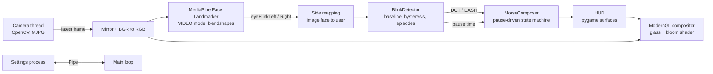

# Blink Morse

Type Morse code with your eyes. A webcam watches your face: a right wink is a dot, a blink with both eyes is a dash, and a short pause finishes the letter. Symbols are typed the moment the blink is seen, and the decoded text appears on screen as you go, no hands needed.


<sub>Interface preview, rendered with a placeholder camera image.</sub>

---

## Quick start

### 1. Requirements

| | |
|---|---|
| Python | 3.10, 3.11 or 3.12 (MediaPipe does not always support the newest Python right away) |
| Webcam | Any USB, built-in or phone camera. 30 FPS or more is recommended |
| GPU | Anything that supports OpenGL 3.3 (every integrated GPU from the last ten years) |
| OS | Windows 10/11 (main target), macOS and Linux also work |

### 2. Install

**Windows (PowerShell)**

```powershell
cd AI_computer_vision_morse_coding
python -m venv .venv
.venv\Scripts\Activate.ps1
python -m pip install --upgrade pip
pip install -r requirements.txt
```

**macOS / Linux**

```bash
cd AI_computer_vision_morse_coding
python3 -m venv .venv
source .venv/bin/activate
python -m pip install --upgrade pip
pip install -r requirements.txt
```

> The project uses **pygame-ce**, a maintained fork of pygame. If the classic `pygame` package is already installed in the same environment, remove it first with `pip uninstall pygame`, because both packages provide the `pygame` module.

### 3. Run

```bash
python main.py
```

On the first launch the face tracking model (`face_landmarker.task`, about 3.7 MB) is downloaded into `models/`. Later launches work offline.

### 4. Run the tests (optional)

```bash
python -m unittest discover -s tests -v
```

The tests cover the Morse logic, the blink detector and the left/right eye mapping. They do not need a camera.

---

## How to use it

Sit facing the camera with your face well lit. "Right" always means **your own** right eye. Nothing is drawn on your face; everything is shown in the panels around it.

| Input | Result |
|---|---|
| **Wink right** | Dot `·` (typed within about 50 ms) |
| **Blink both eyes** | Dash `–` (typed on the first frame both eyes are closed) |
| **Keep your eyes open 0.5 s** | End of letter, the Latin letter pops up |
| **Keep your eyes open 2 s** | End of word, a space is added |

This works like real Morse code, where the silence between signals separates letters and words. Both pauses are counted from the moment your eyes open after the last blink, and a countdown ring next to the current letter shows how close the letter is to being confirmed.

**Example: typing "HI"**

1. Wink right four times (`····`) and wait. After half a second **H** pops up.
2. Wink right twice (`··`) and wait. **I** pops up.
3. Keep waiting until two seconds have passed and a space is added.

**Normal blinks.** People blink without thinking 15 to 20 times a minute, and because a dash is typed the instant both eyes close, those blinks type dashes too. Press **P** to pause listening whenever you want to rest your eyes, and press it again to continue. If stray dashes still bother you, raise **Blink filter** in the settings window a little (0.05 to 0.1 s): very quick blinks are then ignored, at the cost of that much delay on each dash.

A left wink does nothing, and deleting is done on the keyboard.

While a letter is in progress, the chart on the right dims every character you can no longer reach and highlights the exact match, so you never need to memorise the whole alphabet.

### Keyboard shortcuts

| Key | Action |
|---|---|
| `X` | Open or close the settings window |
| `P` | Pause or resume listening to your eyes |
| `H` | Show or hide the Morse chart |
| `M` | Mute or unmute sounds |
| `Backspace` | Delete the last symbol, or the last letter if no symbol is pending |
| `Delete` | Clear everything |
| `Esc` / `Q` | Quit |

### Settings window


Press `X` to open it. It has two tabs. Changes apply instantly and are saved to `settings.json` when the app closes.

**Camera tab**
- Live stats: the real capture resolution, camera FPS and app FPS. Green is 30 FPS or more, amber is 15 to 30, red is below 15.
- Device number, with the device name underneath on Windows (for example "Integrated Webcam" or "Camo"), resolution, target FPS (30 or 60), mirror view, auto exposure, and manual exposure, brightness, contrast and gain.
- **Driver settings** (Windows) opens the camera maker's own settings dialog.

**Eyes tab**
- **Close threshold**: how closed an eye must be to count. Watch the Eye closure bars in the main window while you adjust it. The white tick on each bar is the threshold.
- **Wink confirm**: how long the right eye must be closed on its own before it counts as a wink. It only needs to be long enough to tell a wink from one eye leading a normal blink. Default 0.05 s.
- **Blink filter**: how long both eyes must stay closed before a dash is typed. 0 means instantly.
- **Letter pause** and **Word pause**: the silences that end a letter (default 0.5 s) and a word (default 2 s).
- **Swap left / right eye**: for cameras or phone apps that already mirror the image.

### Using an iPhone or Android phone as the camera

A phone camera is usually much sharper than a laptop webcam, and sharper eyes make winks easier to read. Install a "phone as webcam" app such as Camo, iVCam or EpocCam on both the phone and the PC, connect the phone by USB, and the phone shows up as an extra camera. In the settings window, step **Device** to the new camera (its name is shown on Windows). Put the phone at eye level and light your face from the front.

### Troubleshooting

| Problem | Fix |
|---|---|
| "Camera unavailable" | Close other apps using the camera (Teams, Zoom, OBS), or pick another device in the settings window. |
| FPS below 15 | Choose 640×480 in settings, turn off auto exposure in a dark room (long exposure halves the frame rate), and plug the laptop in. |
| Winks are missed | Lower **Close threshold** a little. Good, even lighting on the face helps most. |
| A blink sometimes types a dot | Raise **Wink confirm** to 0.07 or 0.08 s. |
| Normal blinks type dashes | Press **P** while resting, or raise **Blink filter** a little. |
| Letters end too early or too late | Change **Letter pause**. |
| Input feels slow | Choose 60 FPS in settings. At 30 FPS each frame is 33 ms apart, at 60 FPS only 17 ms. |
| Left and right are swapped | Turn on **Swap left / right eye**. |
| Glasses | Usually fine. Strong reflections on the lenses can hide the eyelids, so tilt the screen or the light slightly. |
| Model download fails | Download the file from the URL in `blink_morse/config.py` and save it as `models/face_landmarker.task`. |

---

## Tech stack

| Part | Library | Why |
|---|---|---|
| Face tracking | [MediaPipe Face Landmarker](https://ai.google.dev/edge/mediapipe/solutions/vision/face_landmarker) | 478 face points plus 52 expression scores, including one blink score per eye, in real time on a normal CPU |
| Camera | [OpenCV](https://opencv.org/) | Reads the webcam and controls exposure, brightness and so on |
| Window and input | [pygame-ce](https://pyga.me/) | Window, keyboard, text rendering and sound playback |
| Rendering | [ModernGL](https://github.com/moderngl/moderngl) (OpenGL 3.3) | Draws the frosted glass panels and the neon glow on the graphics card |
| Maths | [NumPy](https://numpy.org/) | Signal maths and sound synthesis |
| Camera names | [pygrabber](https://github.com/andreaschiavinato/python_grabber) (Windows, optional) | Lists DirectShow device names for the settings window |
| Fonts | Inter and JetBrains Mono | Bundled in `assets/fonts` under the SIL Open Font License |

No sound files and no image assets are shipped: every sound is synthesised at start-up and every shape is drawn in code.

---

## How it works (non-technical overview)

Think of the app as a small assembly line with five stations.

1. **The camera takes pictures.** About 30 to 60 times a second, the webcam sends a new picture of you.

2. **The face reader measures your eyes.** A pre-trained model from Google finds your face and gives each eye a score from 0 (wide open) to 1 (fully shut). Everybody's eyes rest at a slightly different level, so the app first learns what "open" looks like for you, and measures closing from there.

3. **The blink reader types symbols.** The moment both eyes are shut, it types a dash. When only the right eye is shut, it waits a couple of frames (about 50 milliseconds, far less than a blink takes) to make sure the left eye is really staying open, and then types a dot. That tiny wait is what stops the start of a normal blink, where one eye often closes a split second before the other, from being read as a wink.

4. **The Morse translator listens to the silence.** Just like a radio operator, it treats a short silence as the end of a letter and a longer silence as the end of a word. After half a second with your eyes open, the dots and dashes collected so far are looked up in the international Morse table. After two seconds, a space is added. If a code does not exist, the app shows a red question mark instead of guessing.

5. **The screen shows the result.** The camera picture is dimmed and information panels that look like frosted glass float around it. Two bars show how closed each eye is, the newest symbol ripples when it lands, a ring counts down to the end of the letter, and the finished letter pops up and is added to the message at the bottom. A short sound confirms every symbol, so you can type without looking.

The app never records or uploads anything. Every picture is processed in memory and thrown away straight after.

## How it works (technical deep dive)

### Pipeline



### Threads and processes

- **Camera thread** (`camera.py`) blocks on `VideoCapture.read()` and publishes only the newest frame through a `threading.Condition`. The main loop wakes up as soon as a frame arrives and never processes the same frame twice. `CAP_PROP_BUFFERSIZE = 1` and MJPG are requested so frames are fresh and 720p can still reach 30 to 60 FPS. On Windows the backends are tried in the order DirectShow, Media Foundation, default, which also covers virtual cameras created by phone-webcam apps.
- **Main thread** runs detection, the blink detector, HUD drawing and the OpenGL composition, in that order. The symbol and its sound are produced before any texture upload or drawing, so rendering never adds to the reaction time.
- **Settings process** (`settings_window.py`). The main window owns an OpenGL context, and a second SDL window in the same process can steal or invalidate it. Running the settings UI in a `spawn` child process avoids that and keeps slider dragging from stalling the render loop. Messages are small tuples over a `multiprocessing.Pipe`.

### Signal: blendshapes and side mapping (`face_tracker.py`)

The Face Landmarker runs in `VIDEO` mode with `output_face_blendshapes=True`. Of the 52 ARKit-style blendshapes, `eyeBlinkLeft` and `eyeBlinkRight` are used. They respond to true lid closure much better than an eye-aspect-ratio computed from the mesh, whose eyelid points tend not to close fully.

MediaPipe names both landmarks and blendshapes after the face **as depicted in the image** (see [google-ai-edge/mediapipe#6368](https://github.com/google-ai-edge/mediapipe/issues/6368)). Mirroring the frame therefore swaps them: in the default selfie view, `eyeBlinkLeft` is the user's right eye. `build_result()` applies that swap once, so every other module only sees the user's own left and right. A unit test pins this down.

### Blink detector (`blinks.py`)

**Per-user baseline.** `EyeSignal` tracks the lower envelope of each raw score while the eye is open (it falls quickly, with a 0.25 s time constant, and rises slowly, with 2 s), capped at 0.4. The normalised closure is `(raw - baseline) / (1 - baseline)`. This matters for people with narrower eyes and for laptop cameras, where looking down at the screen lowers the lids and raises the resting score.

**Hysteresis.** An eye becomes closed above `close_threshold` (0.45) and opens again below `close_threshold - 0.15`.

**Pose per frame.** `open`, `left`, `right` or `both`. When both are above the threshold but differ by more than 0.28, it is classified as a wink of the more closed eye, because the open eye often squints along.

**Episodes.** From the first closed frame until both eyes have been open for two frames in a row (so one noisy frame cannot split a blink into two dashes). Each episode types at most one symbol:

| Situation | Result | Delay |
|---|---|---|
| Both eyes closed | `DASH` | none, or `blink_filter` if set |
| Right eye closed alone for `wink_confirm` (0.05 s, at least 2 frames) while the left score is below 60 % of the threshold | `DOT` | about 50 ms |
| Same, but the left eye is squinting | `DOT` after 3 × `wink_confirm` | about 150 ms |
| Left eye alone | nothing, and the episode is used up so it cannot turn into a dash | |

The confirmation for the dot exists because a normal blink does not close both lids on exactly the same frame. Checking that the left eye is clearly open (not merely below the threshold) makes the rule stricter still: if the left eye is already on its way down, the detector waits and the episode becomes a dash.

The detector also reports `pause_time`: seconds since both eyes opened after the last episode. It does not decide anything about letters or words itself.

### Morse state machine (`morse.py`)

`MorseComposer` knows nothing about cameras, so it can be tested with plain function calls. It is driven by symbols and by the idle time reported every frame:

| State | Input | Result |
|---|---|---|
| any | dot / dash | append to `code`, cancel a pending space |
| `code` not empty | idle ≥ `letter_gap` (0.5 s) | decode, `LETTER` (arms the space) or `INVALID` |
| space armed | idle ≥ `word_gap` (2 s) | `SPACE` (never leading, never doubled) |
| `code` already 6 symbols long | dot / dash | `INVALID` right away, since no code is longer |
| any | Backspace | remove last symbol, otherwise last character |

Both gaps are measured from the same moment, so typing a new symbol between 0.5 s and 2 s simply continues the same word. The table follows ITU-R M.1677-1 for A to Z, 0 to 9 and common punctuation.

### Rendering (`compositor.py` and `hud.py`)

Each frame uploads three textures and draws one full-screen triangle strip with a single fragment shader:

1. **Camera texture** with mipmaps. A cover crop (like CSS `object-fit: cover`) fills the 800×600 window at any camera aspect ratio without stretching. The image is then desaturated, cooled, darkened and vignetted.
2. **Glass panels.** Up to 8 rectangles are passed as uniforms. A rounded-rectangle signed distance field gives anti-aliased edges, a soft drop shadow, a hairline border that is brighter at the top, and an accent colour for flashes. Inside a panel the camera is sampled at mip level 3.4 with five taps, which gives a smooth frosted blur almost for free.
3. **Glow layer.** An opaque black pygame surface where the symbols, meters and letters are drawn again in colour. The shader adds three mip levels of it (1.0, 2.6 and 4.2), which gives the neon bloom without extra framebuffers or blur passes.
4. **UI layer.** A transparent pygame surface with text, meters and icons, blended last. Nothing is drawn over the face.
5. A little animated film grain removes banding in the dark gradients.

### Audio (`audio.py`)

Tones are built with NumPy: a sine wave plus a soft second harmonic and a short attack and release to avoid clicks. The dash lasts three times as long as the dot, as in real Morse timing. The mixer is opened with a 256-sample buffer (about 6 ms) so the sound follows the blink closely.

### Performance budget

On the CPU side (camera upload, HUD drawing, layer upload) a frame takes about 10 ms. The Face Landmarker with blendshapes adds roughly 8 to 20 ms depending on the CPU, which keeps the app between 30 and 60 FPS on a typical laptop. VSync is off so the camera sets the pace and no extra frame of latency is added.

End-to-end, a dash is typed one camera frame plus one detection after the eyes close (roughly 30 to 60 ms at 60 FPS), and a dot about 50 ms later than that.

---

## Project structure

```
AI_computer_vision_morse_coding/
├── main.py                  entry point
├── requirements.txt
├── blink_morse/
│   ├── app.py               main loop, wires everything together
│   ├── config.py            constants, colours, saved settings
│   ├── camera.py            threaded webcam reader
│   ├── face_tracker.py      MediaPipe wrapper, model download, eye mapping
│   ├── blinks.py            wink and blink detector
│   ├── morse.py             Morse table and pause-driven composer
│   ├── hud.py               everything drawn on top of the camera
│   ├── draw.py              anti-aliased shapes, glow sprites, easing
│   ├── compositor.py        ModernGL shader: glass panels and bloom
│   ├── audio.py             synthesised feedback sounds
│   └── settings_window.py   settings window (separate process)
├── assets/fonts/            Inter and JetBrains Mono (OFL)
├── models/                  face model, downloaded on first run
├── docs/                    screenshots for this README
└── tests/                   unit tests for Morse logic and blinks
```

## Credits

- Face tracking model: Google MediaPipe, Apache License 2.0.
- Fonts: Inter by Rasmus Andersson and JetBrains Mono by JetBrains, both under the SIL Open Font License 1.1 (licence files in `assets/fonts`).
